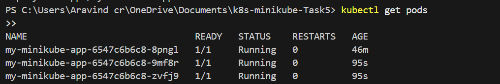

# Kubernetes Minikube - Task 5

## Overview
This project demonstrates deployment of a simple application in Kubernetes using Minikube, including creating a Deployment and exposing it via a Service.

## Steps Performed
1. Started Minikube
2. Applied `deployment.yaml` and `service.yaml`
3. Verified pods and services
4. Accessed the app in browser

## Screenshots

---
Minikube Version: v1.33.1  
Kubernetes Version: v1.30.0
